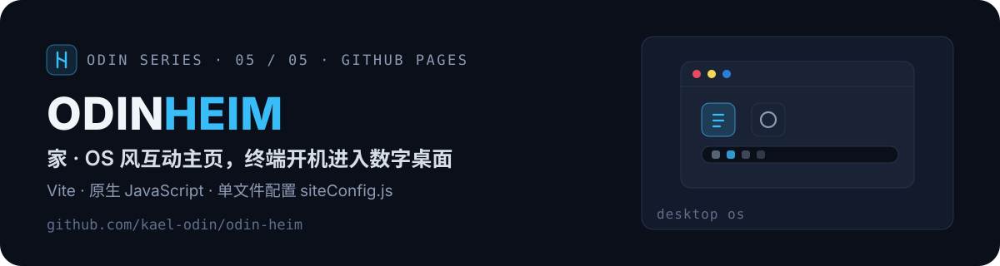
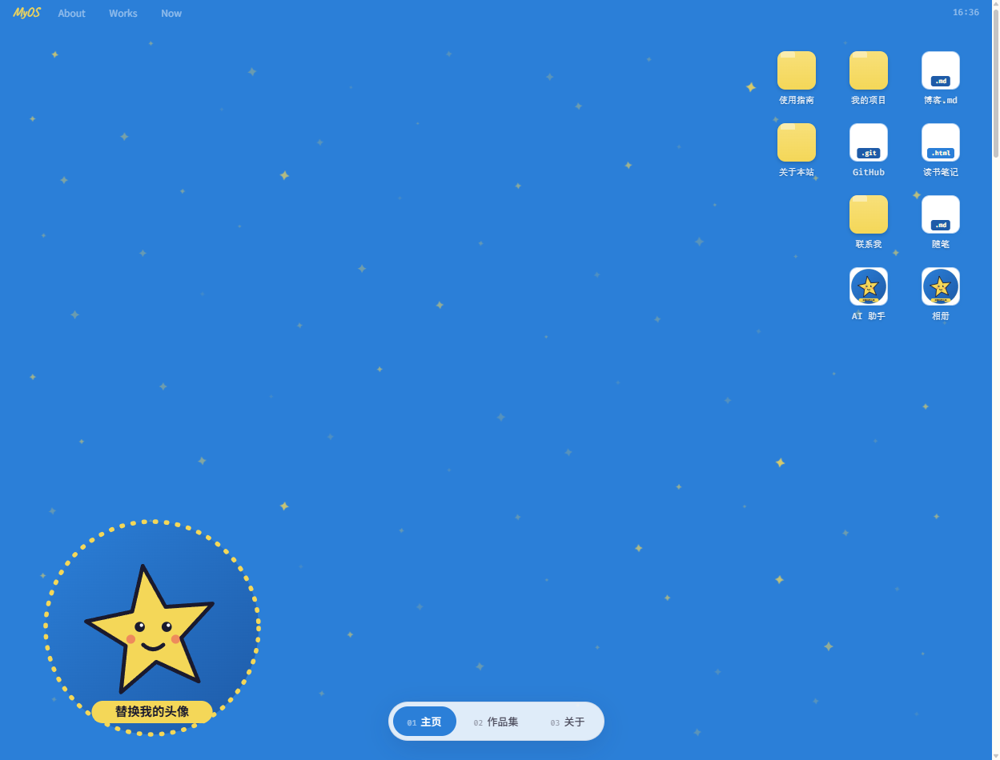
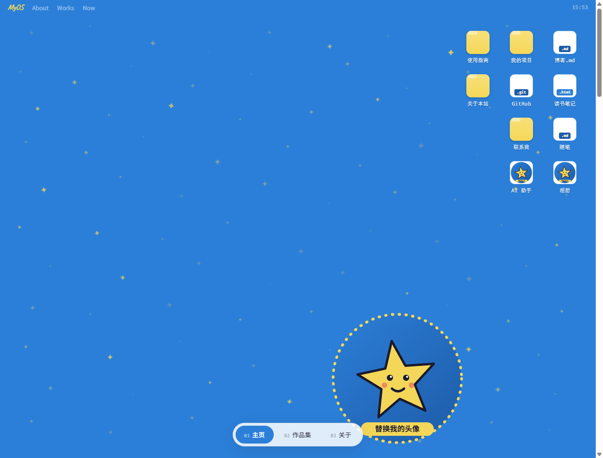
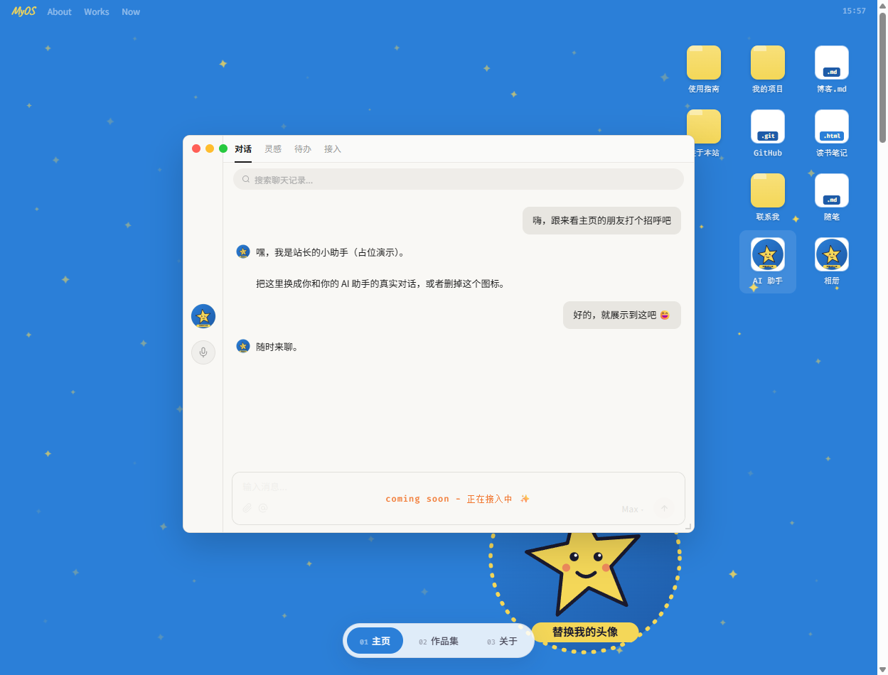
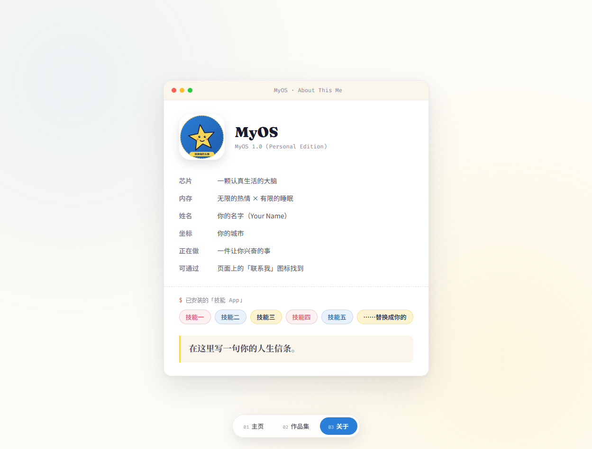

<p align="center">
  
</p>

<p align="center">
  <a href="https://kael-odin.github.io/odin-heim/"></a>
  <a href="https://github.com/kael-odin/odin-heim/actions/workflows/deploy-pages.yml"></a>
  
  
</p>

## ✨ 这是什么

一个以「操作系统」为灵感的互动个人主页模板：访客先看到一台正在打字的终端，按下 Enter「开机」后进入仿 macOS 桌面——可拖拽的图标、可缩放的窗口、会躲鼠标的星星壁纸，以及一个会和你道别的告别屏。**改一个配置文件就能变成你自己的主页。**

| 终端开机 | 个人桌面 |
| --- | --- |
|  |  |
| **AI 助手窗口** | **关于页** |
|  |  |

## 🌟 特性

- 🖱️ **零后端、零数据库** —— 纯静态站点，GitHub Pages / Vercel / Netlify 直接部署
- ⚙️ **单文件配置** —— 所有内容集中在 [`src/config/siteConfig.js`](src/config/siteConfig.js)，每个字段都有中文注释
- 🖥️ **完整 OS 隐喻** —— 终端开机 → 桌面 → 窗口管理器（拖拽/缩放/红绿灯）→ 告别屏循环
- 📱 **移动端适配** + `prefers-reduced-motion` 支持，无障碍友好

## 🚀 快速开始

```bash
npm install
npm run dev      # http://localhost:5173
npm run build    # 构建到 dist/
```

要求 Node.js ≥ 18。

## 🎨 三步变成你的

**第 1 步 · 改配置**：打开 [`src/config/siteConfig.js`](src/config/siteConfig.js) 替换占位内容——`name`/`bioLines`（终端开场白）、`socials`（联系我）、`desktopIcons`（桌面图标，内置窗口 id：`win-contact` / `win-projects` / `win-assistant` / `win-hello` / `win-meta`）、`projects`（作品集）、`about`（关于本机面板）。

**第 2 步 · 换图片**：替换 [`public/avatar.svg`](public/avatar.svg) 头像贴纸与 [`public/favicon.svg`](public/favicon.svg)。

**第 3 步 · 改配色（可选）**：主题色在 [`src/styles/site.css`](src/styles/site.css) 顶部 `:root` 变量（`--blue` / `--yellow` / `--red` / `--cream`）。

## 🌐 部署

仓库内置 `.github/workflows/deploy-pages.yml`，推送自动发布到 GitHub Pages（Settings → Pages → Source 选 GitHub Actions 即可）。Vercel / Netlify 选 Vite 框架、产物目录 `dist` 亦可。

## 🔧 二次开发小抄

- **增桌面图标**：`desktopIcons` 加一行（`win` 填窗口 id，`style.top/right` 定位）
- **增弹窗窗口**：`src/components/windows/index.jsx` 的 `TEMPLATES` 注册 `[id, 组件]`
- **改交互 / 样式**：`src/lib/sections/` 与 `src/styles/sections/` 按模块拆分，注释全中文

## 🧭 Odin 系列

| 符 | 仓库 | 定位 | 访问 |
| --- | --- | --- | --- |
| 🌈 | [odin-bifrost](https://github.com/kael-odin/odin-bifrost) | 个人作品集主站（Next.js Bento） | [live](https://kael-odin.github.io/odin-bifrost/) |
| ⚡ | [odin-valhalla](https://github.com/kael-odin/odin-valhalla) | 深色作品集模板（React + Vite） | [live](https://kael-odin.github.io/odin-valhalla/) |
| 🗿 | [odin-runestone](https://github.com/kael-odin/odin-runestone) | 双语作品集模板（Vite + GSAP） | [live](https://kael-odin.github.io/odin-runestone/) |
| 📜 | [odin-saga](https://github.com/kael-odin/odin-saga) | 博客与数字花园（Next.js） | [live](https://odin-saga.vercel.app/) |
| 🏠 | **odin-heim** | OS 风互动主页模板（Vite） | 这里 |

> 同一套北欧神话命名 `odin-<词根>`，词根即职能：彩虹桥是入口，英灵殿陈列功绩，卢恩石碑刻生平，萨迦记事，heim 是家。

## 📄 许可

原始设计与交互出自 [ESTHER不二](https://hiesther.me/) 的个人网站（[esther-website-1](https://github.com/esthersjw/esther-website-1)），本模板遵循其原始许可 **[CC BY-NC 4.0](./LICENSE)**（署名 - 非商业性使用）：✅ 可自由使用、修改、二次分发（需保留署名）；❌ 不得用于商业目的。如果你做出了自己的版本，欢迎给原作和本仓库各点个 Star ⭐

---

<p align="center"><sub><b>ODIN SERIES</b> · bifrost / valhalla / runestone / saga / heim · crafted by <a href="https://github.com/kael-odin">Kael Odin</a></sub></p>
